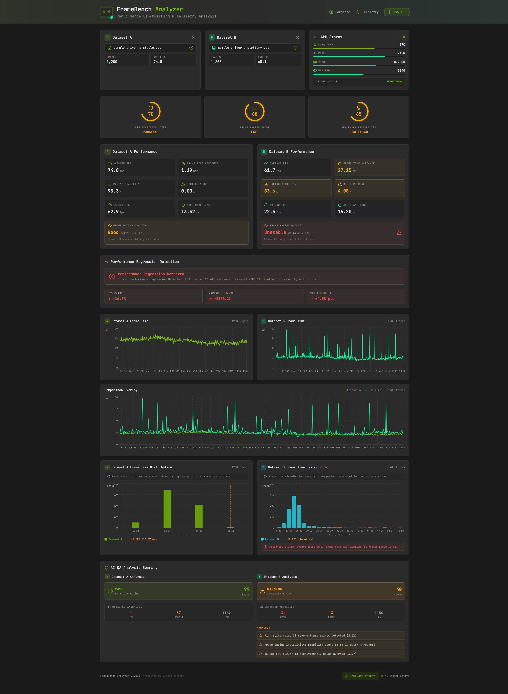

# FrameBench Analyzer

GPU driver benchmarking and frame time telemetry analysis dashboard for detecting frame pacing instability, stutter events, and performance regressions between driver builds.

Supports native Nvidia FrameView CSV exports as well as generic frame time capture formats. Runs as a web app (PWA) with offline support.

## Dashboard Demo

## Performance Report

## Live Demo

https://vinodh-framebench-analyzer.bolt.host

---

## Overview

FrameBench Analyzer processes frame time telemetry collected during gameplay benchmarks and produces a detailed performance analysis.

The tool detects:

- Frame pacing instability and micro stutters
- Performance regressions between driver builds
- Frame time anomalies using statistical spike detection
- Hardware bottlenecks from FrameView metadata

Sessions and their results are persisted to a Supabase database so historical comparisons can be reviewed at any time.

A built-in demo mode generates synthetic sample datasets so the tool can be explored without uploading real captures.

---

## Key Features

**Driver Comparison Mode**
Upload telemetry from two driver builds (Driver A vs Driver B) and compare performance stability side by side.

**Native Nvidia FrameView CSV Support**
Upload CSV files exported directly from Nvidia FrameView. Hardware metadata — GPU model, CPU model, render resolution, and application name — is automatically extracted from the file header and displayed in the session panel.

**Multi-Format CSV Ingestion**
Accepts FrameView exports (`MsBetweenPresents`, `MsBetweenDisplayChange`), PresentMon captures (`FrameTime`), and generic frame time CSVs. Compressed `.csv.gz` files are also supported. `NA` values and extra columns are handled gracefully.

**Large File Processing**
CSV files up to 50,000 rows are processed using a Web Worker to avoid blocking the UI. Files exceeding 25,000 frames are noted as truncated in the display; full frame counts are preserved in metadata.

**Animated Telemetry Dashboard**
NVIDIA-themed dashboard with a custom animated dual-fan GPU widget, circular score indicators, frame time line charts, and frame time distribution histograms.

**QA Anomaly Analysis**
Statistical spike detection classifies anomalies as High, Medium, or Low severity and assigns an overall QA score (0–100) with a PASS / WARNING / FAIL stability rating.

**Driver Regression Detection**
Automatically flags regressions when a new driver shows an FPS drop greater than 3%, a variance increase greater than 20%, or a stutter score increase greater than 2 points versus a baseline.

**HTML Report Export**
Generate a downloadable, self-contained HTML performance report with a dark NVIDIA-styled layout including all metrics, QA analysis, and regression verdict.

**PWA Support**
Installable as a Progressive Web App on desktop and mobile with offline capability via a service worker.

**Demo Mode**
The "Generate Sample Telemetry" button creates two synthetic datasets — a stable baseline and a stuttery comparison — so the full workflow can be explored without uploading files.

---

## Supported CSV Formats

| Source | Required Column | Notes |
|---|---|---|
| Nvidia FrameView | `MsBetweenPresents` or `MsBetweenDisplayChange` | Also parses hardware metadata columns |
| PresentMon | `FrameTime` or `frame_time` | |
| Generic | `FrameTime`, `frame_time`, or `frame time` | Any CSV with a recognizable frame time column |

FrameView exports additionally provide hardware metadata columns (`Application`, `GPU`, `CPU`, `Resolution`) which are parsed automatically when present.

Compressed `.csv.gz` files are supported in addition to plain `.csv`.

---

## Metrics Calculated

| Metric | Description |
|---|---|
| Average FPS | Mean frames per second across the capture |
| 1% Low FPS | Frame rate at the 1st percentile — represents worst-case stutter |
| 0.1% Low FPS | Frame rate at the 0.1st percentile — extreme outlier performance |
| Min / Max FPS | Absolute floor and ceiling frame rates |
| Average Frame Time | Mean milliseconds per frame |
| Frame Time Variance | Statistical variance of frame delivery timing |
| Frame Pacing Stability | 0–100% score reflecting frame delivery consistency |
| Stutter Score | Percentage of frames delivered more than 1.5x slower than average |
| QA Overall Score | 0–100 composite rating combining stability, variance, and anomaly counts |
| Stability Rating | PASS / WARNING / FAIL verdict based on QA score thresholds |

---

## Example Workflow

1. Run a gameplay benchmark and capture frame times using Nvidia FrameView (or any compatible tool)
2. Export the capture as a CSV file
3. Open FrameBench Analyzer and upload the CSV - hardware metadata is auto-detected from FrameView exports
4. Upload a second CSV for comparison 
5. FrameBench Analyzer computes metrics, runs QA analysis, and produces a regression verdict
6. Download the HTML report or save the session to the database for future reference
7. Use the demo mode to explore the full workflow without uploading files

---

## Database Schema

Data is persisted to Supabase with Row Level Security enabled on all tables. Anonymous users can read and write records created within the last 24 hours.

### `telemetry_sessions`

Stores one record per comparison session.

| Column | Type | Description |
|---|---|---|
| `id` | uuid | Primary key |
| `session_name` | text | Auto-generated session label |
| `driver_a_name` | text | Filename of Driver A CSV |
| `driver_b_name` | text | Filename of Driver B CSV |
| `gpu_name` | text | GPU model auto-detected from FrameView CSV |
| `cpu_name` | text | CPU model auto-detected from FrameView CSV |
| `resolution` | text | Render resolution auto-detected from FrameView CSV |
| `application` | text | Application/game name from FrameView CSV |
| `csv_source` | text | Source format: `frameview` or `generic` |
| `created_at` | timestamptz | Session creation timestamp |

### `frame_data`

Stores per-frame telemetry rows linked to a session. Sampled to a maximum of 10,000 frames per driver before storage.

| Column | Type | Description |
|---|---|---|
| `id` | uuid | Primary key |
| `session_id` | uuid | Foreign key to `telemetry_sessions` |
| `driver_label` | text | `A` or `B` |
| `frame_number` | integer | Sequential frame index |
| `frame_time` | float8 | Frame duration in milliseconds |
| `created_at` | timestamptz | Row creation timestamp |

### `comparison_results`

Stores computed metrics and regression analysis for a session.

| Column | Type | Description |
|---|---|---|
| `id` | uuid | Primary key |
| `session_id` | uuid | Foreign key to `telemetry_sessions` |
| `metrics_a` | jsonb | Computed metrics for Driver A |
| `metrics_b` | jsonb | Computed metrics for Driver B |
| `qa_analysis_a` | jsonb | QA anomaly analysis for Driver A |
| `qa_analysis_b` | jsonb | QA anomaly analysis for Driver B |
| `regression_result` | jsonb | Regression verdict and details |
| `created_at` | timestamptz | Result creation timestamp |

---

## Future Improvements

Planned upgrades include:

- Windows desktop app release (Electron)
- DLSS artifact detection
- Automated benchmark ingestion pipeline
- ML-based frame pacing prediction
- Multi-session trend analysis across driver versions

---

## Inspiration

This project was created as a tool for hardware perfomance analysis, GPU driver QA pipelines used in graphics driver validation labs.

---

## Author

Vinodh Shekhar
